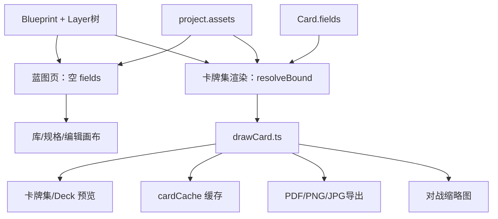

# 技术架构

> `[反推]` 以下内容由现有代码结构反推。

## 技术栈

| 层 | 选型 | 说明 |
|----|------|------|
| UI | React 19 + TypeScript | 函数组件，React Router Hash 路由 |
| 画布编辑 | react-konva + Konva | 蓝图编辑器交互层 |
| 卡牌渲染 | Canvas 2D API | `src/render/drawCard.ts` 离屏绘制，用于预览/导出/对战缩略图 |
| 状态 | Zustand | 见下方 Store 分工 |
| 构建 | Vite 7 | 开发端口 1420 |
| 桌面壳 | Tauri 2 + 现有 Node 本地服务 | 日常用 TMD **窗口**，不经系统浏览器。见 [desktop-app.md](./features/desktop-app.md) |
| 联机 | PeerJS | WebRTC 点对点，辅以房间 API |
| 导出 | pdf-lib、Canvas / pngjs | PDF 拼版；PNG / JPG 光栅（页图或单卡） |
| PSD | ag-psd | 导入 Photoshop 图层 |
| 包装盒 3D | WebGL | 方盒预览、UV 壳、产品渲染静帧；后期转台序列帧 |

## 产品信息架构（已确认）

工作室首页一级 Tab 名为 **桌游创作**（原「卡牌创作」）。打开项目后，创作工作区按维度划分：

```
桌游创作
├── 卡牌           规格预览块；蓝图库预览块 → 编辑；数据集、卡组
├── 板件           贴图扣形 + 厚度；库预览块
├── 包装盒         包装库预览块 → 结构 / UV / 渲染
└── 说明书         规则书（编辑器细节待补）
```

项目级：变量、媒体、舞台（试玩）、**产品渲染**（场景库预览块 → 内部编辑）、打印、设置。打印主要服务卡牌；产品渲染出宣传/实物静帧（含板件、盒）。

## 路由与页面地图

> 下列为当前代码路由。

```
/                 LandingPage       落地页、下载
/app              HomePage          工作室首页（桌游创作/对战/市场/论坛/新闻）
/play             PlayPage          独立对战入口
/market           MarketPage        市场（也可嵌入 HomePage）
/project/*        WorkspaceLayout   项目工作区（需已打开项目）
  template        TemplateEditor    蓝图编辑（属卡牌）
  board           BoardPage         板件：库 → 贴图扣形 + 厚度
  sets            SetsPage          数据集浏览
  deck            DeckPage          卡组表格
  box             BoxPage           包装盒：结构 / 贴图 / 渲染
  shot            ProductShotPage   产品渲染：场景库 → 内部编辑（卡/板/盒同场景）
  manual          ManualPage        说明书占位
  vars            VarsPage          项目变量
  media           MediaPage         媒体库
  stage           PlayPage          项目内对战设置
  print           PrintPage         打印导出
  settings        SettingsPage      项目设置
```

源码入口：[`src/App.tsx`](../src/App.tsx)

## 模块分层

```
src/
├── features/     页面与功能模块（按路由划分）
├── store/        全局 Zustand 状态
├── model/        数据类型、校验、归一化、starter 模板
├── render/       卡牌绘制、布局、吸附、富文本
├── persist/      IndexedDB、File System Access、文件夹格式
├── lib/          工具（颜色、mm、zip、字体、PSD 等）
└── ui/           通用 UI 组件
```

## 状态管理分工

### `appStore` — 项目生命周期

`[反推]` 职责：

- 应用启动 `boot()`：加载索引、种子示例、官方市场
- 当前打开的项目 `current` / `currentPath` / `dirty` / `saving`
- 撤销/重做栈（最多 80 步，320ms 内同 mergeKey 合并）
- CRUD：创建、打开、保存、导入/导出、删除、重链文件夹
- 市场订阅/上架

### `editorStore` — 编辑器会话

`[反推]` 职责（不持久化到 project.json）：

- 当前蓝图 `blueprintId`、正/背面 `face`
- 选中图层 `selectedId`、剪贴板
- 视口 `view`（缩放、平移、网格、出血、吸附）
- 预览 DPI、蓝图库开关、规格面板 `specId`

### 其他 Store

| Store | 用途 |
|-------|------|
| `localeStore` | 中英文切换 |
| `themeStore` | 明暗主题 |
| `homeViewStore` | 首页 Tab、书架视图 |
| `onboardingStore` | 新手引导进度 |
| `playProfileStore` | 对战昵称、头像 |
| `playLookStore` | 牌桌主题、天气 |

## 渲染管线



- 尺寸单位：编辑器内 mm，渲染时 `mmToPx(dpi)`
- 图层树：`parentId` 相对坐标，group 类型可嵌套
- 变量绑定：`layer.vars` → 卡牌集 `fieldKeys` 列；**蓝图页不注入 Card.fields**

## 持久化策略

### 双轨存储

1. **IndexedDB** — 浏览器内缓存项目 JSON 与索引
2. **文件夹格式** (`ceditor-folder-v1`) — 用户选定本地目录：
   - `project.json` — 元数据、蓝图、卡牌集（资产引用为相对路径）
   - `data/boards/` — 板件（贴图扣形件）
   - `assets/` — 图片、字体等二进制
   - `.ceditor` — 格式标记

### Tauri / Node 扩展

`src/persist/nodeFs.ts` 在桌面环境下支持：

- 绝对路径读写
- 资源管理器选文件夹
- `/__fs/` 静态服务本地文件

### 本机偏好（不进项目）

- 分栏宽度、主题、语言等：localStorage
- **导出参数预设**（`ExportPreset[]`）：localStorage，见 [print-export.md](./features/print-export.md)；读取后写入当前 `Project.print`

### 遗留兼容

- 旧版 `templates` + `decks` 在 `normalizeProject()` 中自动转为 `blueprints` + `sets`
- schema 版本：`PROJECT_SCHEMA_VERSION = 1`，高于当前版本的文件拒绝打开

## 联机架构（概要）

- **PeerJS** 建立 P2P 数据通道
- **roomsApi** 发布/发现房间（局域网邀请码、广域网中继）
- **playSync** 同步牌桌状态（牌堆、手牌、道具、笔迹）
- 详见 [play-mode.md](./features/play-mode.md)

## 离线包与桌面窗口

日常运行见 [desktop-app.md](./features/desktop-app.md)：TMD 窗口加载本机服务，**不再打开系统浏览器**。

`npm run pack`（`scripts/pack.mjs`）仍可打两份解压 zip（试用 / 尚无安装包时），复制到 `public/`：

| 产物 | 系统 | 内置运行时 |
|------|------|------------|
| `TMD-offline.zip` | Windows x64 | `vendor/node`（`node.exe`） |
| `TMD-offline-mac.zip` | macOS Apple 芯片 | 包内 `darwin-arm64` Node（与 Windows 缓存目录分开，互不覆盖） |

zip 启动入口：Windows 为 **TMD.exe**（bat 后备）；Mac 仍是 `.command`。窗口壳是 WebView2 + Node sidecar。Mac `.app` 不能在 Windows 上交叉编译。规格见 [offline-pack.md](./features/offline-pack.md)、[desktop-app.md](./features/desktop-app.md)。

## 开发命令

```bash
npm run dev      # Vite 开发
npm run start    # 0.0.0.0:1420（开发机可开浏览器）
npm run desktop:exe  # 编出仓库根目录 TMD.exe
npm run build    # tsc + vite build
npm run pack     # Windows + Mac 离线 zip → release/ 与 public/
npm run tauri    # 可选 Tauri；日常 Windows 窗口是 TMD.exe
```

## 关键文件索引

|  Concern | 文件 |
|----------|------|
| 类型定义 | `src/model/types.ts` |
| 校验 | `src/model/schema.ts` |
| 蓝图↔模板同步 | `src/model/normalize.ts` |
| 绘制 | `src/render/drawCard.ts` |
| 存储 | `src/persist/storage.ts` |
| 文件夹 IO | `src/persist/folderFormat.ts` |
