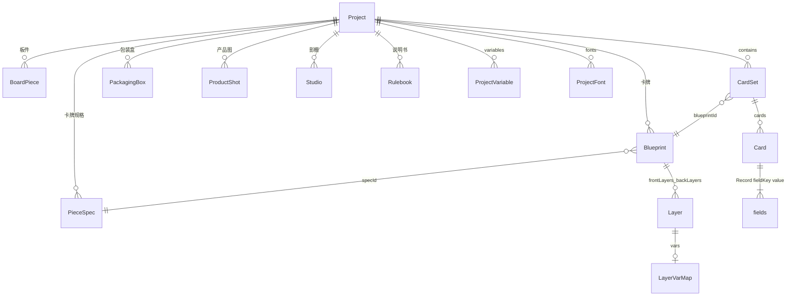

# 数据模型

> 未标注产品确认的段落 `[反推]` 自 `src/model/types.ts`、`schema.ts`、`normalize.ts`。  
> `kind` / `thicknessMm` / `core` / `pieceSpecs` / `boards` / `boxes` / `shots` / `studios` / `textureFit` / `bevelMm` / `rulebooks` / `cameras` / `lookThroughId` / `box.mode` / `box.material` 为产品已确认；说明书编辑器仍占位。

## Schema 版本

- 当前版本：`PROJECT_SCHEMA_VERSION = 1`
- 打开时若 `schemaVersion > 1` → 拒绝并提示升级应用
- 校验入口：`validateProject()` → `normalizeProject()` → `syncDerived()`

## 核心概念关系



**桌游创作维度**（产品已确认）：

| 维度 | 数据 | 说明 |
|------|------|------|
| 卡牌 | `pieceSpecs` + `blueprints` + `sets` | 规格是纸张物理参数块；蓝图挂规格并选竖/横。纸厚与卡芯写在规格上（产品渲染用，不改变 2D 排版） |
| 板件 | `boards` | 一张贴图按 alpha 扣形 + 板厚 + 最长边 mm。不走蓝图图层。见 [boards.md](./features/boards.md) |
| 包装盒 | `boxes` | 简单方盒或详细天地盖；印刷图+UV（详细则天/地各一套）；底色/金属/反光；烫金与UV遮罩；倒角；天盒口沿半圆缺口；单盒渲染 |
| 产品渲染 | `shots` | 场景库 + 场景编辑；透视/等距；卡/板/盒同框出**静帧**产品图。序列帧改走影棚 |
| 影棚 | `studios` | 宣传镜头：模版 + 演员槽 + 秒数；可引用产品场景当布景；出 PNG 序列。见 [studio.md](./features/studio.md) |
| 说明书 | `rulebooks` | 占位；字段待说明书规格补全 |

`[反推]` 当前代码只有 Blueprint / CardSet 的完整编辑器；包装盒、产品渲染已落地，说明书仍占位。

**术语对照（遗留兼容）**：

| 新术语 | 旧术语 | 说明 |
|--------|--------|------|
| Blueprint | Template（正+背成对） | 一张卡牌或一块板件的正反面图层 |
| CardSet | Deck | 引用一个蓝图的数据集（不拥有、不回写蓝图） |
| Template | — | 由 Blueprint 派生，仅渲染用 |

`syncDerived()` 保证 `blueprints`/`sets` 与 `templates`/`decks` 始终同步。

## Project

```typescript
type Project = {
  schemaVersion: number;
  meta: ProjectMeta;
  pieceSpecs?: PieceSpec[];  // 卡牌物理规格；缺省打开时由蓝图迁移补齐
  blueprints: Blueprint[];
  boards?: BoardPiece[];     // 贴图扣形板件，缺省视为 []
  sets: CardSet[];
  boxes?: PackagingBox[];     // 包装盒，缺省视为 []
  shots?: ProductShot[];      // 产品渲染场景，缺省视为 []
  studios?: Studio[];         // 影棚，缺省视为 []
  rulebooks?: Rulebook[];     // 说明书，缺省视为 []
  templates: Template[];   // 派生，勿手改
  decks: Deck[];           // 派生，勿手改
  assets: Record<string, string>;  // assetId → URL 或相对路径
  variables: ProjectVariable[];
  print?: PrintSettings;
  fonts?: ProjectFont[];
  playSetup?: PlaySetupSnapshot;
};
```

### ProjectMeta

| 字段 | 类型 | 说明 |
|------|------|------|
| id | string | 项目唯一 ID |
| name | string | 显示名称 |
| note | string? | 备注 |
| coverAsset | string? | 封面资产 ID |
| createdAt / updatedAt | ISO string | 时间戳 |
| defaultSize | SizeMm | 新建规格的竖放基准；也作空项目第一条默认规格 |
| defaultSpecId | string? | 新建蓝图默认挂这条规格 |

## PieceSpec

项目里的 **卡牌规格**（预览块）。多张卡牌蓝图共用一条。交互见 [pieces.md](./features/pieces.md)。板件不走规格，见 `BoardPiece`。

```typescript
type PieceSpec = {
  id: string;
  name: string;
  kind: "card" | "board";
  /** 竖放基准：宽=短边、高=长边 */
  size: SizeMm;
  thicknessMm: number;
  core?: "white" | "black"; // 仅卡牌
  bleedMm: number;
  cornerRadiusMm: number;
  /** 从哪条内置模版复制来的，仅备注。有值仍可编辑 */
  sourceTemplateId?: string;
};
```

内置模版规格（扑克牌、塔罗、三国杀、万智牌等）**不写入** `pieceSpecs`，见 [pieces.md](./features/pieces.md)。蓝图 `specId` 只能指向项目里的自定义规格。

`Project.meta.defaultSpecId?: string` 默认卡牌规格；缺则用引用最多的一条。

## BoardPiece

贴图扣形板件。与卡牌蓝图独立。交互见 [boards.md](./features/boards.md)。

```typescript
type BoardPiece = {
  id: string;
  name: string;
  textureAssetId: string;   // project.assets；推荐透明 PNG
  thicknessMm: number;      // 默认 2
  /** 平面包络最长边 mm。另一边按贴图像素比。缺省 40 */
  longestMm?: number;
};
```

`Project.boards?: BoardPiece[]`。缺省 `[]`。产品渲染 `kind: "board"` 的 `refId` 指向这里。旧 `Blueprint.kind === "board"` 仅兼容列出，新建不写蓝图。

## Blueprint

一张**卡牌**的正反面定义。图层上的 `text` / `style` / `visible` 等是蓝图自有数据，**永远不被数据集覆盖**。`vars` 只是列名声明：数据集渲染时用 `card.fields` 覆盖对应属性；蓝图页始终用图层自身的值。

物理参数以挂接的 `PieceSpec` 为准，蓝图上的 `size` / `bleedMm` / `cornerRadiusMm` / `thicknessMm` / `core` 是 **同步副本**（给渲染/打印直接读，避免到处解析规格）。改规格或朝向时必须写回这些副本。禁止在蓝图上单独改副本而不改规格。

| 字段 | 类型 | 说明 |
|------|------|------|
| id | string | 蓝图 ID |
| name | string | 名称 |
| kind | `"card"` \| `"board"` | 新数据为 `card`。`board` 仅旧工程兼容，见 BoardPiece |
| specId | string | 所挂 `PieceSpec.id` |
| orientation | `"portrait"` \| `"landscape"` | 竖放 / 横放。横放把规格竖放基准的宽高对调 |
| size | SizeMm | 成品宽高（mm），由规格 + 朝向算出 |
| thicknessMm | number? | 自规格同步 |
| core | `"white"` \| `"black"`? | 自规格同步 |
| bleedMm | number | 自规格同步 |
| cornerRadiusMm | number | 自规格同步。**产品渲染网格必须使用** |
| frontLayers | Layer[] | 正面图层树 |
| backLayers | Layer[] | 背面图层树 |

- 竖放：`size = spec.size`；横放：`size = { w: spec.size.h, h: spec.size.w }`
- 旧项目无 `pieceSpecs` / `specId` 时，打开即迁移（见 pieces.md「打开旧工程」），**不改图层与现有宽高数值**
- 改 kind：界面不再把卡牌改成板件；旧 `board` 蓝图保留兼容

## Layer

| 字段 | 类型 | 说明 |
|------|------|------|
| id | string | 图层 ID |
| type | LayerType | text / image / rect / icon / group |
| name | string | 图层名（未绑变量时可能自动进表） |
| text | string? | 蓝图预览文案 |
| x, y, w, h | number | 位置尺寸（mm，相对 parentId） |
| rotation | number? | 旋转角度 |
| style | LayerStyle | 样式（见下） |
| visible | boolean? | 蓝图内显隐 |
| visibleWhen | string? | **已废弃**，改用 vars.active |
| locked | boolean? | 锁定不可编辑 |
| vars | LayerVarMap? | 属性→卡牌集列名（声明用；蓝图页不读该列的值） |
| repeatPerRow | number? | 图标 repeat 时每行个数 |
| parentId | string? | 父图层（group 子节点） |

### LayerStyle 主要字段

字体、颜色、对齐、描边、阴影、渐变、margin、knockout、overflow（clip/ellipsis/shrink）、autosize 等。单位后缀 `Mm` 表示毫米。

### LayerVarMap

| 键 | 绑定属性 |
|----|----------|
| text, fill, stroke, color, background, src, repeat | 对应 style/内容 |
| active | bool 字段，仅卡牌集渲染时控制显隐；蓝图页用 layer.visible |

## CardSet

| 字段 | 类型 | 说明 |
|------|------|------|
| id | string | 卡牌集 ID |
| name | string | 名称 |
| blueprintId | string | 关联蓝图 |
| cards | Card[] | 卡牌列表 |
| fieldKeys | string[] | 列名顺序（与蓝图 vars 同步；**数据列全集**，视窗只决定怎么看） |
| fieldTypes | Record<string, FieldType>? | text / bool / image / number |
| views | CardSetView[]? | 飞书式视窗；缺省时实现补一个「默认」视窗 |
| activeViewId | string? | 当前视窗（也写入项目，换设备能还原） |

`fieldKeys` 由蓝图图层 `vars` 自动推导，额外列可保留。卡牌集引用 `blueprintId`，改 `cards[].fields` **不得**写回蓝图图层。

### CardSetView

校对数据用的视窗（对标飞书多维表格视窗）。**不改卡片数据**，只记「怎么看表」。

```typescript
type CardSetView = {
  id: string;
  name: string;
  columnOrder: string[];                 // 可见+隐藏列的排列（含未出现在 fieldKeys 的忽略）
  hiddenColumns: string[];               // 隐藏的列名
  columnWidths: Record<string, number>;  // 列宽 px；缺省列用统一默认宽
};
```

- 至少保留一个视窗，不可删光
- 新列出现时追加到各视窗 `columnOrder` 末尾，默认可见
- 拖拽列头改的是**当前视窗**的 `columnOrder`，不是 `fieldKeys`

## Card

| 字段 | 类型 | 说明 |
|------|------|------|
| id | string | 卡牌 ID |
| qty | number | 卡组数量（Deck 页用） |
| fields | Record<string, string> | 列名 → 值（bool 存 "true"/""） |

## ProjectVariable

全局文本/图标替换变量（非图层绑定）。

| 字段 | 说明 |
|------|------|
| tag | 占位符如 `{foo}` |
| replacement | 替换内容 |
| kind | text / icon |
| tint | icon 着色 |

## PackagingBox

包装盒。默认新建 **100 × 150 × 50 mm**（界面可显示 10 × 15 × 5 cm）。

```typescript
type BoxFace = "top" | "bottom" | "front" | "back" | "left" | "right";

type BoxMode = "simple" | "lidBase";
type BoxSleeve = "upDown" | "frontBack" | "leftRight";

/** 一面在该件印刷贴图 UV 空间里的矩形壳（Maya 式：移动 / 缩放 / 旋转） */
type UvIsland = {
  u: number;           // 壳中心 U（0–1）
  v: number;           // 壳中心 V（0–1）
  w: number;           // 壳宽（UV，未乘 scale 的尺寸）
  h: number;           // 壳高
  scaleX?: number;     // Unity 式缩放，默认 1
  scaleY?: number;     // Unity 式缩放，默认 1
  uniformScale?: boolean; // 默认 true：等比例，改一边带另一边
  rotationDeg?: number;
  flipU?: boolean;
  flipV?: boolean;
};

/** 一张印刷图 + 六面壳。外壁必有 faces；内壁图可空（空则底色），innerFaces 仍可先摆。 */
type BoxPartMaps = {
  textureAssetId?: string;
  textureFit?: "original" | "cover" | "tile";
  textureTileScale?: number;
  /** 印刷图在 UV 0–1 里顺时针转，仅 0/90/180/270，缺省 0。不改壳坐标。 */
  textureRotationDeg?: 0 | 90 | 180 | 270;
  faces: Record<BoxFace, UvIsland>;
  innerTextureAssetId?: string;
  innerTextureFit?: "original" | "cover" | "tile";
  innerTextureTileScale?: number;
  innerTextureRotationDeg?: 0 | 90 | 180 | 270;
  innerFaces?: Record<BoxFace, UvIsland>;
  foilMaskAssetId?: string;      // 黑白，白=烫金；只跟外壁 UV，铺法同 textureFit / textureRotationDeg
  varnishMaskAssetId?: string;   // 黑白，白=UV 光油；只跟外壁 UV，铺法同 textureFit / textureRotationDeg
};

type BoxMaterial = {
  baseColor?: string;   // 缺省 #ffffff。无印刷或透明处显示；有印刷处贴图盖住，不与底色相乘
  metallic?: number;    // 0–1，缺省 0。整盒纸面，不是烫金
  roughness?: number;   // 0–1，缺省 0.55；界面「反光度」= 1 - roughness
  foilColor?: string;   // 缺省 #d4af37
  foilMetallic?: number;   // 烫金金属度，缺省 0.95
  foilRoughness?: number;  // 烫金粗糙度，缺省 0.12（反光度 0.88）
  foilGrain?: number;      // 烫金磨砂颗粒 0–1，缺省 0.55
  foilGrainStyle?: "cell" | "frost"; // cell 方块格子（缺省）；frost 无格子连续颗粒
  varnishRoughness?: number; // UV 光油粗糙度，缺省 0.02，可低到 0.002（镜面清漆）
  varnishCoat?: number;      // UV 清漆强度 0–4，缺省 1.5；侧面掠射也要反光，>2 接近镜子
};

type BoxRenderSetup = {
  position: { x: number; y: number; z: number };
  rotationDeg: { x: number; y: number; z: number };
  camera: {
    yaw: number;
    pitch: number;
    distance: number;
    fov: number;
    /** 轨道看向点（世界 mm）。缺省 {0,0,0}。渲染模式中键或 Alt+左键平移改这个 */
    target?: { x: number; y: number; z: number };
  };
  /** 产品渲染用。透视=透视投影+FOV；等距=正交投影，忽略 fov。包装盒单盒渲染可暂不读。缺省 perspective */
  projection?: "perspective" | "isometric";
  lights: {
    key: { yaw: number; pitch: number; intensity: number; color: string };
    fillIntensity?: number;
    ambient?: number;
  };
  background?: string;
  cullBackground?: boolean;   // 透明背景、不画底面
  cullOutsideBox?: boolean;   // 按盒子画面包围盒裁边
  resolutionW?: number;
  resolutionH?: number;
  /**
   * 点「渲染」时的贴图档。缺省 max。
   * viewport 交互不读这个字段（视口继续低 DPI）。
   * max：卡面 300 DPI（单边≤4096）；板件贴图原图像素。
   * standard：卡面 150 DPI。
   */
  exportTexture?: "standard" | "max";
};

type PackagingBox = {
  id: string;
  name: string;
  lengthMm: number;  // 默认 100；详细模式=地盒外长
  widthMm: number;   // 默认 150
  heightMm: number;  // 默认 50；详细模式=合盖后天盒顶面高度
  mode?: BoxMode;                    // 缺省 simple
  lidHeightMm?: number;              // 仅 lidBase
  baseHeightMm?: number;             // 仅 lidBase
  wallMm?: number;                   // 仅 lidBase，缺省 1.5
  lidFitMm?: number;                 // 仅 lidBase，缺省 1；天内壁相对地外壁的间隙
  sleeve?: BoxSleeve;                // 仅 lidBase，缺省 upDown。前后=地口前/天口后
  lidOpen?: number;                  // 仅 lidBase，0 合盖 1 打开；缺省 0。打开=天盒沿套合轴正方向平移、不翻转
  /** 仅 lidBase。天盒开口圈「上下」那一对壁口沿居中半圆。缺省 false */
  lidNotchUpDown?: boolean;
  /** 仅 lidBase。天盒开口圈「左右」那一对壁口沿居中半圆。缺省 false */
  lidNotchLeftRight?: boolean;
  /** 仅 lidBase。半圆半径 mm，缺省 10。两组都不勾时不挖口 */
  lidNotchRadiusMm?: number;
  material?: BoxMaterial;            // 天/地共用
  textureAssetId?: string;           // simple：整盒印刷图
  textureFit?: "original" | "cover" | "tile";
  textureTileScale?: number;
  textureRotationDeg?: 0 | 90 | 180 | 270; // simple：印刷图顺时针转；缺省 0
  foilMaskAssetId?: string;          // simple 工艺遮罩
  varnishMaskAssetId?: string;
  bevelMm?: number;                  // 棱边倒角，mm，默认 0
  faces: Record<BoxFace, UvIsland>;  // simple 六面壳
  lid?: BoxPartMaps;                 // lidBase 天盒图+UV
  base?: BoxPartMaps;                // lidBase 地盒图+UV
  render?: BoxRenderSetup;
};
```

约束：没有 per-face 漫反射 `assetId`。简单模式换图只改根上的 `textureAssetId`，六面壳保留，无内壁。详细模式天、地各一份 `BoxPartMaps`：外壁 `textureAssetId`+`faces`，内壁 `innerTextureAssetId`+`innerFaces`（可空，空则底色）。**禁止**内壁采样外壁 UV。工艺遮罩只跟外壁壳，铺法与该件外壁 `textureFit` 相同，旋转与 `textureRotationDeg` 相同。屏幕上的壳宽高 = `w * (scaleX ?? 1)`、`h * (scaleY ?? 1)`。`textureFit` / `innerTextureFit` 各自铺进 UV 0–1，然后再按该层 `textureRotationDeg` 顺时针转。旧数据无旋转字段视为 0。

地盒外壁默认 UV 网 ≠ 天盒十字网：先把前/后壳对调，再整网绕 `(0.5, 0.5)` 转 180°（见 [packaging.md](./features/packaging.md)）。`innerFaces`、天盒、简单方盒仍用 `defaultUvNet`。打开旧工程不要自动改已保存的壳。

旧工程无 `mode` 视为 `simple`。切到 `lidBase` 时若还没有 `lid`/`base`，把当前 `textureAssetId` + `faces` 复制为 **外壁**，再单独生成 `innerFaces` 默认展开（按内板尺寸，不要复制外壁壳）。旧 `lidBase` 没有 `innerFaces` 时同样补默认内壳，内图保持空。

`lidBase`：`sleeve` 缺省 `upDown`（地口上、天口下）；`frontBack` 地口前天口后；`leftRight` 地口右天口左。旧数据无 `sleeve` 视为上下。天内径 = 垂直套合轴的地外径 + 2×`lidFitMm`，天外径再加 2×`wallMm`。`lidOpen` 缺省 0；1 时天盒沿该轴正方向移约件深+10mm，不翻转。旧数据无 `lidOpen` 视为合盖。

天盒口沿半圆缺口：`lidNotchUpDown` / `lidNotchLeftRight` 缺省 false；`lidNotchRadiusMm` 缺省 10。旧数据无此三字段视为不挖口。只改天盒开口圈网格，地盒不挖。两对边与套合轴的对应见 [packaging.md](./features/packaging.md)。半径夹紧到 ≥0、不超过该壁开口跨度一半、不超过天盒件深约 90%。简单模式忽略这些字段。

`resolutionW` / `resolutionH` 缺省 1920×1080，可预选或自定义（**大于 0**，上限约 32768）。键入过程中不要夹到 256。`exportTexture` 缺省 `max`：出图卡面 300 DPI、板件用原图；视口不读此字段。`camera.target` 缺省原点；产品渲染与包装盒 3D 渲染视口用 **中键拖** 或 Alt+左键平移看向点。旧数据无 `target` 视为 `{0,0,0}`。

## ProductShot

产品渲染场景。一个项目可有多个；物件是实例，不拥有蓝图/盒子。

```typescript
type ProductShotItem = {
  id: string;
  kind: "card" | "board" | "box" | "stack";
  /** card → blueprintId；board → BoardPiece.id；box → boxId；stack → setId。布局槽位未填时为空字符串 */
  refId: string;
  setId?: string;     // kind=card 时所属卡牌集
  cardId?: string;    // kind=card 时哪一张
  /** 卡牌、卡牌集共用。front 正面朝上（缺省）；back 背面朝上。背面朝上 = 局部先 Rx180 再 Ry180，顶面仍贴正面、底面仍贴背面 */
  face?: "front" | "back";
  position: { x: number; y: number; z: number };
  rotationDeg: { x: number; y: number; z: number };
  scale?: number;     // 默认 1
  slotId?: string;    // 布局模版槽位；未填时视口画占位体
  /** 仅 kind=box 且详细天地盖。0 合上～1 打开。缺省跟随包装盒 `lidOpen`，不改包装页 */
  lidOpen?: number;
  /** 仅 kind=stack。缺省 = 满集 + 牌组形态 */
  stack?: ShotStackLook;
};

type ShotStackShape = "deck" | "messy" | "row" | "fan";
type ShotFanDir = "up" | "down";

type ShotStackLook = {
  shape?: ShotStackShape;  // 缺省 deck
  /** 展开 qty 后的张序，1-based 闭区间。缺省满集 */
  countFrom?: number;
  countTo?: number;
  /** 一字、扇形共用：一字为中心距额外量；扇形加在上弧。缺省 4 */
  gapMm?: number;
  /** 一字、扇形共用。ltr 从左到右（缺省）；rtl 从右到左。叠放仍从上到下 */
  spread?: "ltr" | "rtl";
  /** 扇形下缘弦宽 mm。缺省约短边×0.6 */
  fanInnerMm?: number;
  /** 扇形上缘弧长 mm。缺省约长边×2.8 */
  fanOuterMm?: number;
  /** @deprecated 仅旧数据；有 fanInner/Outer 时忽略 */
  fanDeg?: number;
  /** @deprecated 旧扇形站姿；朝上改读 item.face。未写 face 时 down = 背面朝上 */
  fanDir?: ShotFanDir;
  /** 扇叶：bottomUp 从下到上（缺省）；topDown 从上到下 */
  fanLeaf?: "bottomUp" | "topDown";
  /** 错落强度 0–1。缺省 0.4 */
  messy?: number;
};

type ProductShotLook = {
  outline?: { enabled: boolean; color: string; widthPx: number };
  vignette?: number;  // 0–1
  bloom?: number;
  exposure?: number;  // 1 = 不变
  contrast?: number;
  saturation?: number;
  blur?: number;
};

/** Maya 式场景摄像机。视线沿局部 −Z。产品渲染场景物体，不是灯光。 */
type ShotCamera = {
  id: string;
  name: string;           // 默认 persp、Camera1…
  position: { x: number; y: number; z: number };
  rotationDeg: { x: number; y: number; z: number };
  fov: number;            // 透视；等距时忽略
  projection?: "perspective" | "isometric";
};

type ProductShot = {
  id: string;
  name: string;
  items: ProductShotItem[];
  cameras?: ShotCamera[];   // 至少一台；缺省打开时从 render.camera 生成 persp
  lookThroughId?: string;   // 当前视口与静帧渲染看穿的摄像机。缺省第一台
  render: BoxRenderSetup;   // 灯光/背景/分辨率；camera 轨道与当前看穿机同步
  look?: ProductShotLook;
  layoutId?: string;        // 最近应用的内置布局 id（empty / box-fan / box-row / box-stack-fan）
  /** @deprecated 序列帧改走影棚。打开忽略，不要实现场景上的渲染序列 */
  sequence?: ShotSequence;
};

/** @deprecated 见 Studio。旧文档字段，打开丢弃即可 */
type ShotSequence = {
  mode?: "turntable";
  frames?: number;
  fps?: number;
  yawFrom?: number;
  yawTo?: number;
};
```

`Project.shots?: ProductShot[]`。缺省 `[]`。进入产品渲染页 **不要**自动建场景；库为空就显示空态。序列帧见下方 `Studio`，不要在 `ProductShot` 上实现。

卡牌 / 卡牌集放入场景时默认卡面平行地面、正面朝上。新放入 `rotationDeg = {0,0,0}`（头尾已编进网格）。`face` 缺省 `front`：网格顶面始终正面、底面始终背面。`face: "back"` 背面朝上时不换贴图，只在局部先绕 X 180° 再绕 Y 180°。旧扇形若只写了 `stack.fanDir === "down"` 且未写 `face`，视为背面朝上。

卡牌集显示内容由 `stack` 决定：缺省形态 `deck`、张数满集（`Σ cards[].qty`，合计 0 则 1 张）。`countFrom`/`countTo` 按展开后的牌序取闭区间。牌组厚度 = 区间张数 × 蓝图纸厚。错落 / 一字 / 扇形逐张薄片，单件最多 48 张。顶面用区间内最上面那张的正面，底面蓝图背面。`stack` 只存在于场景实例，不写回卡牌集。

包装盒实例只读取该盒已有的 `bevelMm`，产品场景数据里 **没有** 倒角字段。

`cameras` / `lookThroughId`：旧场景没有时，`normalize` 用 `render.camera` 生成一台 `persp` 并看穿它。删摄像机不能删光。看穿机的轨道与 `render.camera` 保持同步。影棚引用场景当布景时只读物件；第一次写入 `backdrop.shotId` 时把该场景看穿机轨道 **同时复制** 到 `Studio.viewCamera` 和 `Studio.render.camera`（以及各自 projection），之后互不回写。

## Studio

宣传片影棚。模版规定剧本和演员槽；物件是引用，不拥有包装盒 / 卡牌集。见 [studio.md](./features/studio.md)。

```typescript
type StudioTemplateId =
  | "unbox-turntable"  // 开盒转台；盒必须 lidBase
  | "box-turntable"    // 盒转台；简单或详细
  | "card-spread"      // 排列展开
  | "card-batch";      // 分批亮相

type StudioOrbitCamera = {
  yaw: number;
  pitch: number;
  distance: number;
  fov: number;
  target?: { x: number; y: number; z: number };
  projection?: "perspective" | "isometric";
};

type StudioActor = {
  slotId: "box" | "stack";
  kind: "box" | "stack";  // 与 slotId 一致
  refId: string;          // box → boxId；stack → setId
  /** 仅 box + 详细天地盖。0 合上～1 打开。缺省 0。开盒转台=开场；盒转台=全程保持 */
  lidOpen?: number;
  /** 仅 stack。与 ProductShotItem.face 相同 */
  face?: "front" | "back";
  /** 仅 stack。与 ProductShotItem.stack 相同；排列/分批的终态读这里，不在 StudioParams */
  stack?: ShotStackLook;
};

type StudioBackdrop = {
  kind?: "none" | "color" | "shot";  // 缺省 none
  color?: string;                    // kind=color
  shotId?: string;                   // kind=shot → ProductShot.id
};

type StudioParams = {
  unboxSeconds?: number;     // 缺省 1.5；仅开盒转台
  turnSeconds?: number;      // 缺省 4
  turns?: number;            // 缺省 1
  overlapUnboxTurn?: boolean; // 缺省 false：先开完再转
  spreadSeconds?: number;    // 缺省 2；排列展开
  batchSize?: number;        // 缺省 8
  batchGapSeconds?: number;  // 缺省 0.8
  /** 仅转台模版。缺省 false：主光钉世界；true：主光 yaw 跟渲染机转台偏航同步 */
  lightsFollowTurn?: boolean;
};

type Studio = {
  id: string;
  name: string;
  templateId: StudioTemplateId;
  actors: StudioActor[];     // 每槽最多一条
  backdrop?: StudioBackdrop;
  params?: StudioParams;
  render: BoxRenderSetup;    // 渲染机 rest + 灯/背景/分辨率/出图贴图/剔除背景
  /** 操作机。序列不吃。缺省 = 打开时从 render.camera 复制 */
  viewCamera?: StudioOrbitCamera;
  /** 视口看穿哪台。缺省 view（操作机） */
  lookThrough?: "view" | "render";
  fps?: number;              // 缺省 24，写出帧数 = round(时长 × fps)
};
```

`Project.studios?: Studio[]`。缺省 `[]`。进入影棚页 **不要**自动建。打开旧工程无 `studios` 视为 `[]`。

约束：

- `unbox-turntable` 的 `box` 槽：`PackagingBox.mode` 必须是 `lidBase`，否则槽无效，不能渲序列
- `box-turntable` 的 `box` 槽：简单或详细都可以
- `card-spread` / `card-batch` 必须有有效 `stack` 槽
- 布景 `kind: "shot"` 且 `shotId` 指向已删场景：布景丢失，不删影棚
- 布景物件与已填演员同一 `kind`+`refId` 时布景不画该件
- 第一次写入 `backdrop.shotId` 时，把该场景看穿机轨道 **同时复制** 到 `viewCamera` 和 `render.camera`（仅这一次）。之后改操作机不得改渲染机
- 打开旧影棚无 `viewCamera`：从当时 `render.camera` + `render.projection` 复制一份；`lookThrough` 缺省 `view`
- 空白拖轨道改 **当前 `lookThrough` 那台**。序列每一帧构图 = `render.camera` rest + 模版偏航，**不吃** `viewCamera`
- 分辨率红框的透视/等距/FOV 永远跟渲染机（`render.camera` / `render.projection`）
- 旧 `params.spreadShape` / `spread` / `countFrom` / `countTo` / `fanInnerMm` / `fanOuterMm` / `gapMm`：normalize 时若该棚已有 `stack` 演员且演员尚未写 `stack`，迁到 `actor.stack`（`spreadShape` → `shape`），然后丢掉 params 上这些字段
- 开盒整体居中只在影棚 compose（天+地 AABB 中心钉槽位原点），不写回包装盒 `lidOpen`，不改包装页预览
- `lidOpen`、播放进度、转台偏航、`lightsFollowTurn` 算出的主光 yaw **不准**进贴图 cache key
- 旧 `ProductShot.sequence` 打开丢弃，不要 migrate 成 Studio（用户在影棚库新建）

## Rulebook

说明书占位。完整字段待 [rulebook.md](./features/rulebook.md) 补交互后再定。

```typescript
type Rulebook = {
  id: string;
  name: string;
  // 页、块、样式：待规格
};
```

## PrintSettings

写入 `Project.print`，随项目保存。界面与显隐规则见 [print-export.md](./features/print-export.md)。

| 字段 | 说明 |
|------|------|
| mode | `print` 打印拼版 / `tts` TTS 贴图 / `single` 单图导出（每张卡单独一张） |
| paper | a4 / letter / legal / tabloid / custom。仅 `print` 使用 |
| orientation | portrait / landscape。仅 `print` |
| customW, customH | 自定义纸宽高（mm）。仅 `print` 且 paper=custom |
| marginMm, gapMm | 纸边距、卡间距（mm）。仅 `print` |
| bleedMm | 拼版排纸用的出血（mm）。仅 `print` 算能放几张时使用 |
| cutMarks, cutColor, cutLengthMm | 裁切线。仅 `print` |
| offsetX, offsetY | 拼版偏移（mm）。仅 `print` |
| duplex | 双面（背面左右镜像；单图则正、背各出一文件） |
| dpi | 导出 DPI |
| filename | 导出文件名模板（{项目}{牌组}{序号}{面}） |
| ttsCols, ttsRows | TTS 行列，仅 `tts` |
| formats | `("png" \| "jpg")[]`，至少一项；可同时选 |
| jpgQuality | JPG 质量 1–100，默认 90 |
| roundCorners | 是否按蓝图 `cornerRadiusMm` 裁圆角 |
| includeBleed | 导出图是否保留出血像素（量用蓝图 `bleedMm`） |
| cardStroke | 是否沿卡外轮廓描边 |
| cardStrokeColor | 描边颜色 |
| cardStrokeMm | 描边粗细（mm） |
| parallelStroke | 是否并列描边（沿轮廓向内的平行框线，类似浮雕内框） |
| parallelStrokeColor | 并列描边颜色，默认 `#c9a227` |
| parallelStrokeMm | 并列描边线宽（mm），默认 0.35 |
| parallelStrokeInsetMm | 外缘到并列线中心的距离（mm），默认 1.2 |
| watermark | 是否叠文字水印（整张导出图） |
| watermarkText | 水印文字；空则用项目名 |
| watermarkOpacity | 水印不透明度 0–100，默认 30 |
| watermarkType | `single` 单一居中 / `tile` 平铺。缺省 `single` |

未列出的旧项目字段打开时按默认补齐。`mode` 缺省视为 `print`；`formats` 缺省视为 `["png"]`。

### ExportPreset（本机，不进 project.json）

对标 Photoshop 首选项：导出参数的命名快照，存在本机 localStorage，跨项目可用。

```typescript
type ExportPreset = {
  id: string;
  name: string;
  settings: PrintSettings;
  updatedAt: string;
};
```

只存 `PrintSettings`，不含卡牌集勾选、页勾选。读取时整份覆盖当前 `Project.print`。

## AppIndex / AppIndexEntry

浏览器内项目索引（IndexedDB），非 project.json 内容。

| 字段 | 说明 |
|------|------|
| path | 列表显示路径 |
| localPath | 用户确认的完整本地路径 |
| origin | owned / subscribed / example |
| marketId | 订阅来源 |

## 文件夹格式 (ceditor-folder-v1)

磁盘上的 `project.json` 不含内联 data URL 大资产；资产存 `assets/` 子目录，JSON 内为相对路径。卡牌规格存 `data/piece-specs/{id}.json`。板件存 **`data/boards/{id}.json`**。影棚存 **`data/studios/{id}.json`**（与 `boxes/`、`shots/` 同级）。漏写 boards 会导致重开后场景里的板件变成「丢失」；漏写 studios 会导致影棚库空。

工程根下另外三份 **产物目录**（不进 `project.json`，可随时删了再导）：`渲染图/` 静帧 PNG；`序列帧/` 影棚 PNG 序列；`导出模型/{名称}/` ASCII FBX+贴图（给 Maya）。见 [product-render.md](./features/product-render.md)、[studio.md](./features/studio.md)。

**覆盖素材**：同一 `assetId` 可被新文件覆盖。覆盖后所有引用该 id 的预览必须立刻换图，不得继续显示旧缓存。

**一键更新**：对每个 `assetId`，用 JSON 里记下的相对路径 / `/__fs/file` 磁盘路径去读本机文件，写回同一 id。不是给每个素材再选一次文件。

标记文件：`.ceditor`

## Starter 模板

创建项目可选 starter（`src/model/starters.ts`）：

empty, poker, sanguosha, mtg, pokemon, mahjong, uno, halligalli

每个 starter 预置 Blueprint + CardSet + 示例 Card。

## 校验规则摘要

1. 必须有 `meta.id`、`meta.name`、`assets` 对象
2. 必须有至少一个 blueprint 和一个 set
3. 旧 projects 自动 migrate templates/decks → blueprints/sets
4. 打开时若无 `pieceSpecs` 或蓝图缺 `specId`，按物理指纹合并补规格（不改图层与现有 size 数值）
5. 三国杀 identity 背面等特殊 patch 在 validate 后应用
6. 产品渲染卡牌集缺 `stack` 视为满集 + 牌组；打开时不改写已存 `rotationDeg`
