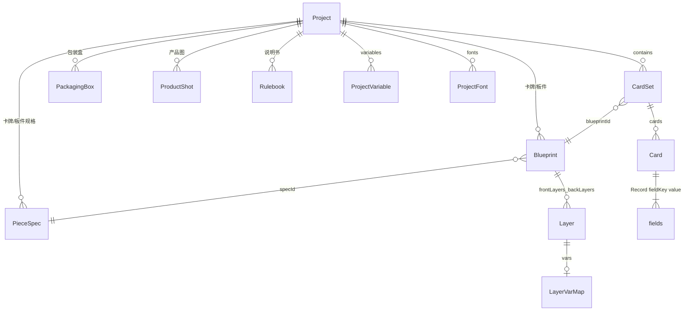

# 数据模型

> 未标注产品确认的段落 `[反推]` 自 `src/model/types.ts`、`schema.ts`、`normalize.ts`。  
> `kind` / `thicknessMm` / `core` / `pieceSpecs` / `boxes` / `shots` / `textureFit` / `bevelMm` / `rulebooks` 为产品已确认；说明书编辑器仍占位。

## Schema 版本

- 当前版本：`PROJECT_SCHEMA_VERSION = 1`
- 打开时若 `schemaVersion > 1` → 拒绝并提示升级应用
- 校验入口：`validateProject()` → `normalizeProject()` → `syncDerived()`

## 核心概念关系



**桌游创作维度**（产品已确认）：

| 维度 | 数据 | 说明 |
|------|------|------|
| 卡牌 / 板件 | `pieceSpecs` + `blueprints` + `sets` | 规格是纸张物理参数块；蓝图挂规格并选竖/横。卡牌纸厚与卡芯、板件板厚写在规格上（产品渲染用，不改变 2D 排版逻辑） |
| 包装盒 | `boxes` | 方盒参数、整盒一张贴图（铺法 original/cover/tile）、棱倒角、每面 UV 壳、单盒渲染 |
| 产品渲染 | `shots` | 场景库 + 场景编辑；透视/等距；卡/板/盒同框出产品图 |
| 说明书 | `rulebooks` | 占位；字段待说明书规格补全 |

`[反推]` 当前代码只有 Blueprint / CardSet 的完整编辑器；包装盒、产品渲染已落地，说明书仍占位。

**术语对照（遗留兼容）**：

| 新术语 | 旧术语 | 说明 |
|--------|--------|------|
| Blueprint | Template（正+背成对） | 一张卡牌或一块板件的正反面图层 |
| CardSet | Deck | 引用一个蓝图的数据集（不拥有、不回写蓝图） |
| Template | — | 由 Blueprint 派生，仅渲染用 |

`syncDerived()` 保证 `blueprints`/`sets` 与 `templates`/`decks` 始终同步。

## Project

```typescript
type Project = {
  schemaVersion: number;
  meta: ProjectMeta;
  pieceSpecs?: PieceSpec[];  // 卡牌/板件物理规格；缺省打开时由蓝图迁移补齐
  blueprints: Blueprint[];
  sets: CardSet[];
  boxes?: PackagingBox[];     // 包装盒，缺省视为 []
  shots?: ProductShot[];      // 产品渲染场景，缺省视为 []
  rulebooks?: Rulebook[];     // 说明书，缺省视为 []
  templates: Template[];   // 派生，勿手改
  decks: Deck[];           // 派生，勿手改
  assets: Record<string, string>;  // assetId → URL 或相对路径
  variables: ProjectVariable[];
  print?: PrintSettings;
  fonts?: ProjectFont[];
  playSetup?: PlaySetupSnapshot;
};
```

### ProjectMeta

| 字段 | 类型 | 说明 |
|------|------|------|
| id | string | 项目唯一 ID |
| name | string | 显示名称 |
| note | string? | 备注 |
| coverAsset | string? | 封面资产 ID |
| createdAt / updatedAt | ISO string | 时间戳 |
| defaultSize | SizeMm | 新建规格的竖放基准；也作空项目第一条默认规格 |
| defaultSpecId | string? | 新建蓝图默认挂这条规格 |

## PieceSpec

项目里的 **卡牌/板件规格**（预览块）。多张蓝图共用一条。交互见 [pieces.md](./features/pieces.md)。

```typescript
type PieceSpec = {
  id: string;
  name: string;
  kind: "card" | "board";
  /** 竖放基准：宽=短边、高=长边 */
  size: SizeMm;
  thicknessMm: number;
  core?: "white" | "black"; // 仅卡牌
  bleedMm: number;
  cornerRadiusMm: number;
};
```

`Project.pieceSpecs` 缺省 `[]`，打开旧工程时按蓝图指纹迁移，至少一条。

`Project.meta.defaultSpecId?: string` 默认规格；缺则用引用最多的一条。

## Blueprint

一张**卡牌或板件**的正反面定义。图层上的 `text` / `style` / `visible` 等是蓝图自有数据，**永远不被数据集覆盖**。`vars` 只是列名声明：数据集渲染时用 `card.fields` 覆盖对应属性；蓝图页始终用图层自身的值。

物理参数以挂接的 `PieceSpec` 为准，蓝图上的 `size` / `bleedMm` / `cornerRadiusMm` / `thicknessMm` / `core` 是 **同步副本**（给渲染/打印直接读，避免到处解析规格）。改规格或朝向时必须写回这些副本。禁止在蓝图上单独改副本而不改规格。

| 字段 | 类型 | 说明 |
|------|------|------|
| id | string | 蓝图 ID |
| name | string | 名称 |
| kind | `"card"` \| `"board"` | 必须与所挂规格 `kind` 一致。缺省按 `card` |
| specId | string | 所挂 `PieceSpec.id` |
| orientation | `"portrait"` \| `"landscape"` | 竖放 / 横放。横放把规格竖放基准的宽高对调 |
| size | SizeMm | 成品宽高（mm），由规格 + 朝向算出 |
| thicknessMm | number? | 自规格同步 |
| core | `"white"` \| `"black"`? | 自规格同步；板件忽略 |
| bleedMm | number | 自规格同步 |
| cornerRadiusMm | number | 自规格同步。**产品渲染网格必须使用** |
| frontLayers | Layer[] | 正面图层树 |
| backLayers | Layer[] | 背面图层树 |

- 竖放：`size = spec.size`；横放：`size = { w: spec.size.h, h: spec.size.w }`
- 旧项目无 `pieceSpecs` / `specId` 时，打开即迁移（见 pieces.md「打开旧工程」），**不改图层与现有宽高数值**
- 改 kind：改挂同 kind 规格，并同步副本

## Layer

| 字段 | 类型 | 说明 |
|------|------|------|
| id | string | 图层 ID |
| type | LayerType | text / image / rect / icon / group |
| name | string | 图层名（未绑变量时可能自动进表） |
| text | string? | 蓝图预览文案 |
| x, y, w, h | number | 位置尺寸（mm，相对 parentId） |
| rotation | number? | 旋转角度 |
| style | LayerStyle | 样式（见下） |
| visible | boolean? | 蓝图内显隐 |
| visibleWhen | string? | **已废弃**，改用 vars.active |
| locked | boolean? | 锁定不可编辑 |
| vars | LayerVarMap? | 属性→卡牌集列名（声明用；蓝图页不读该列的值） |
| repeatPerRow | number? | 图标 repeat 时每行个数 |
| parentId | string? | 父图层（group 子节点） |

### LayerStyle 主要字段

字体、颜色、对齐、描边、阴影、渐变、margin、knockout、overflow（clip/ellipsis/shrink）、autosize 等。单位后缀 `Mm` 表示毫米。

### LayerVarMap

| 键 | 绑定属性 |
|----|----------|
| text, fill, stroke, color, background, src, repeat | 对应 style/内容 |
| active | bool 字段，仅卡牌集渲染时控制显隐；蓝图页用 layer.visible |

## CardSet

| 字段 | 类型 | 说明 |
|------|------|------|
| id | string | 卡牌集 ID |
| name | string | 名称 |
| blueprintId | string | 关联蓝图 |
| cards | Card[] | 卡牌列表 |
| fieldKeys | string[] | 列名顺序（与蓝图 vars 同步；**数据列全集**，视窗只决定怎么看） |
| fieldTypes | Record<string, FieldType>? | text / bool / image / number |
| views | CardSetView[]? | 飞书式视窗；缺省时实现补一个「默认」视窗 |
| activeViewId | string? | 当前视窗（也写入项目，换设备能还原） |

`fieldKeys` 由蓝图图层 `vars` 自动推导，额外列可保留。卡牌集引用 `blueprintId`，改 `cards[].fields` **不得**写回蓝图图层。

### CardSetView

校对数据用的视窗（对标飞书多维表格视窗）。**不改卡片数据**，只记「怎么看表」。

```typescript
type CardSetView = {
  id: string;
  name: string;
  columnOrder: string[];                 // 可见+隐藏列的排列（含未出现在 fieldKeys 的忽略）
  hiddenColumns: string[];               // 隐藏的列名
  columnWidths: Record<string, number>;  // 列宽 px；缺省列用统一默认宽
};
```

- 至少保留一个视窗，不可删光
- 新列出现时追加到各视窗 `columnOrder` 末尾，默认可见
- 拖拽列头改的是**当前视窗**的 `columnOrder`，不是 `fieldKeys`

## Card

| 字段 | 类型 | 说明 |
|------|------|------|
| id | string | 卡牌 ID |
| qty | number | 卡组数量（Deck 页用） |
| fields | Record<string, string> | 列名 → 值（bool 存 "true"/""） |

## ProjectVariable

全局文本/图标替换变量（非图层绑定）。

| 字段 | 说明 |
|------|------|
| tag | 占位符如 `{foo}` |
| replacement | 替换内容 |
| kind | text / icon |
| tint | icon 着色 |

## PackagingBox

包装盒。默认新建 **100 × 150 × 50 mm**（界面可显示 10 × 15 × 5 cm）。

```typescript
type BoxFace = "top" | "bottom" | "front" | "back" | "left" | "right";

/** 一面在整盒贴图 UV 空间里的矩形壳（Maya 式：移动 / 缩放 / 旋转） */
type UvIsland = {
  u: number;           // 壳中心 U（0–1）
  v: number;           // 壳中心 V（0–1）
  w: number;           // 壳宽（UV，未乘 scale 的尺寸）
  h: number;           // 壳高
  scaleX?: number;     // Unity 式缩放，默认 1
  scaleY?: number;     // Unity 式缩放，默认 1
  uniformScale?: boolean; // 默认 true：等比例，改一边带另一边
  rotationDeg?: number;
  flipU?: boolean;
  flipV?: boolean;
};

type BoxRenderSetup = {
  position: { x: number; y: number; z: number };
  rotationDeg: { x: number; y: number; z: number };
  camera: { yaw: number; pitch: number; distance: number; fov: number };
  /** 产品渲染用。透视=透视投影+FOV；等距=正交投影，忽略 fov。包装盒单盒渲染可暂不读。缺省 perspective */
  projection?: "perspective" | "isometric";
  lights: {
    key: { yaw: number; pitch: number; intensity: number; color: string };
    fillIntensity?: number;
    ambient?: number;
  };
  background?: string;
  cullBackground?: boolean;   // 透明背景、不画底面
  cullOutsideBox?: boolean;   // 按盒子画面包围盒裁边
  resolutionW?: number;
  resolutionH?: number;
};

type PackagingBox = {
  id: string;
  name: string;
  lengthMm: number;  // 默认 100
  widthMm: number;   // 默认 150
  heightMm: number;  // 默认 50
  textureAssetId?: string;           // 整盒唯一贴图；无则未贴图
  /** 贴图占满 UV 0–1 的方式。缺省 cover（撑满，1:1 等比裁边） */
  textureFit?: "original" | "cover" | "tile";
  textureTileScale?: number;         // 仅 tile，默认 1
  bevelMm?: number;                  // 棱边倒角，mm，默认 0
  faces: Record<BoxFace, UvIsland>;  // 每面一块壳，采样同一张贴图
  render?: BoxRenderSetup;
};
```

约束：没有 per-face `assetId`。换图只改 `textureAssetId`，六面 UV 壳保留。屏幕上的壳宽高 = `w * (scaleX ?? 1)`、`h * (scaleY ?? 1)`。`textureFit` 决定贴图如何铺进 UV 0–1，再被各面壳采样。

## ProductShot

产品渲染场景。一个项目可有多个；物件是实例，不拥有蓝图/盒子。

```typescript
type ProductShotItem = {
  id: string;
  kind: "card" | "board" | "box" | "stack";
  /** card/board → blueprintId；box → boxId；stack → setId。布局槽位未填时为空字符串 */
  refId: string;
  setId?: string;     // kind=card 时所属卡牌集
  cardId?: string;    // kind=card 时哪一张
  face?: "front" | "back";
  position: { x: number; y: number; z: number };
  rotationDeg: { x: number; y: number; z: number };
  scale?: number;     // 默认 1
  slotId?: string;    // 布局模版槽位；未填时视口画占位体
};

type ProductShotLook = {
  outline?: { enabled: boolean; color: string; widthPx: number };
  vignette?: number;  // 0–1
  bloom?: number;
  exposure?: number;  // 1 = 不变
  contrast?: number;
  saturation?: number;
  blur?: number;
};

type ProductShot = {
  id: string;
  name: string;
  items: ProductShotItem[];
  render: BoxRenderSetup;   // 摄像机/灯光/背景/分辨率/透视或等距，与包装盒渲染同形
  look?: ProductShotLook;
  layoutId?: string;        // 最近应用的内置布局 id（empty / box-fan / box-row / box-stack-fan）
};
```

`Project.shots?: ProductShot[]`。缺省 `[]`。进入产品渲染页 **不要**自动建场景；库为空就显示空态。

卡牌 / 卡牌集放入场景时默认 `rotationDeg` 使卡面平行地面、正面朝上。`face` 缺省 `front`：顶面正面、底面背面（`backLayers`）。卡牌集顶面代表卡正面、底面蓝图背面。卡牌集显示厚度 = `Σ cards[].qty` × 蓝图纸厚（合计 0 则按 1 张）。

包装盒实例只读取该盒已有的 `bevelMm`，产品场景数据里 **没有** 倒角字段。

## Rulebook

说明书占位。完整字段待 [rulebook.md](./features/rulebook.md) 补交互后再定。

```typescript
type Rulebook = {
  id: string;
  name: string;
  // 页、块、样式：待规格
};
```

## PrintSettings

写入 `Project.print`，随项目保存。界面与显隐规则见 [print-export.md](./features/print-export.md)。

| 字段 | 说明 |
|------|------|
| mode | `print` 打印拼版 / `tts` TTS 贴图 / `single` 单图导出（每张卡单独一张） |
| paper | a4 / letter / legal / tabloid / custom。仅 `print` 使用 |
| orientation | portrait / landscape。仅 `print` |
| customW, customH | 自定义纸宽高（mm）。仅 `print` 且 paper=custom |
| marginMm, gapMm | 纸边距、卡间距（mm）。仅 `print` |
| bleedMm | 拼版排纸用的出血（mm）。仅 `print` 算能放几张时使用 |
| cutMarks, cutColor, cutLengthMm | 裁切线。仅 `print` |
| offsetX, offsetY | 拼版偏移（mm）。仅 `print` |
| duplex | 双面（背面左右镜像；单图则正、背各出一文件） |
| dpi | 导出 DPI |
| filename | 导出文件名模板（{项目}{牌组}{序号}{面}） |
| ttsCols, ttsRows | TTS 行列，仅 `tts` |
| formats | `("png" \| "jpg")[]`，至少一项；可同时选 |
| jpgQuality | JPG 质量 1–100，默认 90 |
| roundCorners | 是否按蓝图 `cornerRadiusMm` 裁圆角 |
| includeBleed | 导出图是否保留出血像素（量用蓝图 `bleedMm`） |
| cardStroke | 是否沿卡外轮廓描边 |
| cardStrokeColor | 描边颜色 |
| cardStrokeMm | 描边粗细（mm） |
| parallelStroke | 是否并列描边（沿轮廓向内的平行框线，类似浮雕内框） |
| parallelStrokeColor | 并列描边颜色，默认 `#c9a227` |
| parallelStrokeMm | 并列描边线宽（mm），默认 0.35 |
| parallelStrokeInsetMm | 外缘到并列线中心的距离（mm），默认 1.2 |
| watermark | 是否叠文字水印（整张导出图） |
| watermarkText | 水印文字；空则用项目名 |
| watermarkOpacity | 水印不透明度 0–100，默认 30 |
| watermarkType | `single` 单一居中 / `tile` 平铺。缺省 `single` |

未列出的旧项目字段打开时按默认补齐。`mode` 缺省视为 `print`；`formats` 缺省视为 `["png"]`。

### ExportPreset（本机，不进 project.json）

对标 Photoshop 首选项：导出参数的命名快照，存在本机 localStorage，跨项目可用。

```typescript
type ExportPreset = {
  id: string;
  name: string;
  settings: PrintSettings;
  updatedAt: string;
};
```

只存 `PrintSettings`，不含卡牌集勾选、页勾选。读取时整份覆盖当前 `Project.print`。

## AppIndex / AppIndexEntry

浏览器内项目索引（IndexedDB），非 project.json 内容。

| 字段 | 说明 |
|------|------|
| path | 列表显示路径 |
| localPath | 用户确认的完整本地路径 |
| origin | owned / subscribed / example |
| marketId | 订阅来源 |

## 文件夹格式 (ceditor-folder-v1)

磁盘上的 `project.json` 不含内联 data URL 大资产；资产存 `assets/` 子目录，JSON 内为相对路径。卡牌规格存 `data/piece-specs/{id}.json`。

**覆盖素材**：同一 `assetId` 可被新文件覆盖。覆盖后所有引用该 id 的预览必须立刻换图，不得继续显示旧缓存。

**一键更新**：对每个 `assetId`，用 JSON 里记下的相对路径 / `/__fs/file` 磁盘路径去读本机文件，写回同一 id。不是给每个素材再选一次文件。

标记文件：`.ceditor`

## Starter 模板

创建项目可选 starter（`src/model/starters.ts`）：

empty, poker, sanguosha, mtg, pokemon, mahjong, uno, halligalli

每个 starter 预置 Blueprint + CardSet + 示例 Card。

## 校验规则摘要

1. 必须有 `meta.id`、`meta.name`、`assets` 对象
2. 必须有至少一个 blueprint 和一个 set
3. 旧 projects 自动 migrate templates/decks → blueprints/sets
4. 打开时若无 `pieceSpecs` 或蓝图缺 `specId`，按物理指纹合并补规格（不改图层与现有 size 数值）
5. 三国杀 identity 背面等特殊 patch 在 validate 后应用
