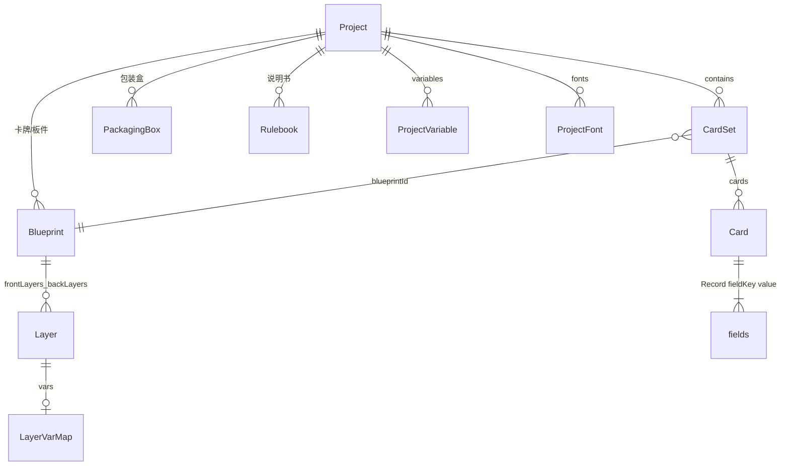

# 数据模型

> 未标注产品确认的段落 `[反推]` 自 `src/model/types.ts`、`schema.ts`、`normalize.ts`。  
> `kind` / `thicknessMm` / `boxes` / `rulebooks` 为产品已确认、代码未落地。

## Schema 版本

- 当前版本：`PROJECT_SCHEMA_VERSION = 1`
- 打开时若 `schemaVersion > 1` → 拒绝并提示升级应用
- 校验入口：`validateProject()` → `normalizeProject()` → `syncDerived()`

## 核心概念关系



**桌游创作维度**（产品已确认）：

| 维度 | 数据 | 说明 |
|------|------|------|
| 卡牌 / 板件 | `blueprints` + `sets` | 蓝图与数据集只在此维度。卡牌无厚度；板件有 `thicknessMm` |
| 包装盒 | `boxes` | 方盒参数、整盒一张贴图、每面独立 UV 壳、渲染机位灯光 |
| 说明书 | `rulebooks` | 占位；字段待说明书规格补全 |

`[反推]` 当前代码只有 Blueprint / CardSet，尚无 `boxes` / `rulebooks` / `kind`。

**术语对照（遗留兼容）**：

| 新术语 | 旧术语 | 说明 |
|--------|--------|------|
| Blueprint | Template（正+背成对） | 一张卡牌或一块板件的正反面图层 |
| CardSet | Deck | 引用一个蓝图的数据集（不拥有、不回写蓝图） |
| Template | — | 由 Blueprint 派生，仅渲染用 |

`syncDerived()` 保证 `blueprints`/`sets` 与 `templates`/`decks` 始终同步。

## Project

```typescript
type Project = {
  schemaVersion: number;
  meta: ProjectMeta;
  blueprints: Blueprint[];
  sets: CardSet[];
  boxes?: PackagingBox[];     // 包装盒，缺省视为 []
  rulebooks?: Rulebook[];     // 说明书，缺省视为 []
  templates: Template[];   // 派生，勿手改
  decks: Deck[];           // 派生，勿手改
  assets: Record<string, string>;  // assetId → URL 或相对路径
  variables: ProjectVariable[];
  print?: PrintSettings;
  fonts?: ProjectFont[];
  playSetup?: PlaySetupSnapshot;
};
```

### ProjectMeta

| 字段 | 类型 | 说明 |
|------|------|------|
| id | string | 项目唯一 ID |
| name | string | 显示名称 |
| note | string? | 备注 |
| coverAsset | string? | 封面资产 ID |
| createdAt / updatedAt | ISO string | 时间戳 |
| defaultSize | SizeMm | 新建蓝图默认尺寸 |

## Blueprint

一张**卡牌或板件**的正反面定义。图层上的 `text` / `style` / `visible` 等是蓝图自有数据，**永远不被数据集覆盖**。`vars` 只是列名声明：数据集渲染时用 `card.fields` 覆盖对应属性；蓝图页始终用图层自身的值。

| 字段 | 类型 | 说明 |
|------|------|------|
| id | string | 蓝图 ID |
| name | string | 名称 |
| kind | `"card"` \| `"board"` | `card` 卡牌；`board` 板件。缺省按 `card` |
| size | SizeMm | 成品宽高（mm），卡牌与板件共用 |
| thicknessMm | number? | **仅板件**。卡牌无厚度：不写或忽略，UI 不展示 |
| bleedMm | number | 出血（mm） |
| cornerRadiusMm | number | 圆角（mm） |
| frontLayers | Layer[] | 正面图层树 |
| backLayers | Layer[] | 背面图层树 |

- 卡牌：`kind === "card"`，无有效厚度
- 板件：`kind === "board"`，`thicknessMm >= 0`（建议默认 2）
- 旧项目无 `kind` 时视为卡牌

## Layer

| 字段 | 类型 | 说明 |
|------|------|------|
| id | string | 图层 ID |
| type | LayerType | text / image / rect / icon / group |
| name | string | 图层名（未绑变量时可能自动进表） |
| text | string? | 蓝图预览文案 |
| x, y, w, h | number | 位置尺寸（mm，相对 parentId） |
| rotation | number? | 旋转角度 |
| style | LayerStyle | 样式（见下） |
| visible | boolean? | 蓝图内显隐 |
| visibleWhen | string? | **已废弃**，改用 vars.active |
| locked | boolean? | 锁定不可编辑 |
| vars | LayerVarMap? | 属性→卡牌集列名（声明用；蓝图页不读该列的值） |
| repeatPerRow | number? | 图标 repeat 时每行个数 |
| parentId | string? | 父图层（group 子节点） |

### LayerStyle 主要字段

字体、颜色、对齐、描边、阴影、渐变、margin、knockout、overflow（clip/ellipsis/shrink）、autosize 等。单位后缀 `Mm` 表示毫米。

### LayerVarMap

| 键 | 绑定属性 |
|----|----------|
| text, fill, stroke, color, background, src, repeat | 对应 style/内容 |
| active | bool 字段，仅卡牌集渲染时控制显隐；蓝图页用 layer.visible |

## CardSet

| 字段 | 类型 | 说明 |
|------|------|------|
| id | string | 卡牌集 ID |
| name | string | 名称 |
| blueprintId | string | 关联蓝图 |
| cards | Card[] | 卡牌列表 |
| fieldKeys | string[] | 列名顺序（与蓝图 vars 同步；**数据列全集**，视窗只决定怎么看） |
| fieldTypes | Record<string, FieldType>? | text / bool / image / number |
| views | CardSetView[]? | 飞书式视窗；缺省时实现补一个「默认」视窗 |
| activeViewId | string? | 当前视窗（也写入项目，换设备能还原） |

`fieldKeys` 由蓝图图层 `vars` 自动推导，额外列可保留。卡牌集引用 `blueprintId`，改 `cards[].fields` **不得**写回蓝图图层。

### CardSetView

校对数据用的视窗（对标飞书多维表格视窗）。**不改卡片数据**，只记「怎么看表」。

```typescript
type CardSetView = {
  id: string;
  name: string;
  columnOrder: string[];                 // 可见+隐藏列的排列（含未出现在 fieldKeys 的忽略）
  hiddenColumns: string[];               // 隐藏的列名
  columnWidths: Record<string, number>;  // 列宽 px；缺省列用统一默认宽
};
```

- 至少保留一个视窗，不可删光
- 新列出现时追加到各视窗 `columnOrder` 末尾，默认可见
- 拖拽列头改的是**当前视窗**的 `columnOrder`，不是 `fieldKeys`

## Card

| 字段 | 类型 | 说明 |
|------|------|------|
| id | string | 卡牌 ID |
| qty | number | 卡组数量（Deck 页用） |
| fields | Record<string, string> | 列名 → 值（bool 存 "true"/""） |

## ProjectVariable

全局文本/图标替换变量（非图层绑定）。

| 字段 | 说明 |
|------|------|
| tag | 占位符如 `{foo}` |
| replacement | 替换内容 |
| kind | text / icon |
| tint | icon 着色 |

## PackagingBox

包装盒。默认新建 **100 × 150 × 50 mm**（界面可显示 10 × 15 × 5 cm）。

```typescript
type BoxFace = "top" | "bottom" | "front" | "back" | "left" | "right";

/** 一面在整盒贴图 UV 空间里的矩形壳（Maya 式：移动 / 缩放 / 旋转） */
type UvIsland = {
  u: number;           // 壳中心 U（0–1）
  v: number;           // 壳中心 V（0–1）
  w: number;           // 壳宽（UV，未乘 scale 的尺寸）
  h: number;           // 壳高
  scaleX?: number;     // Unity 式缩放，默认 1
  scaleY?: number;     // Unity 式缩放，默认 1
  uniformScale?: boolean; // 默认 true：等比例，改一边带另一边
  rotationDeg?: number;
  flipU?: boolean;
  flipV?: boolean;
};

type BoxRenderSetup = {
  position: { x: number; y: number; z: number };
  rotationDeg: { x: number; y: number; z: number };
  camera: { yaw: number; pitch: number; distance: number; fov: number };
  lights: {
    key: { yaw: number; pitch: number; intensity: number; color: string };
    fillIntensity?: number;
    ambient?: number;
  };
  background?: string;
  cullBackground?: boolean;   // 透明背景、不画底面
  cullOutsideBox?: boolean;   // 按盒子画面包围盒裁边
  resolutionW?: number;
  resolutionH?: number;
};

type PackagingBox = {
  id: string;
  name: string;
  lengthMm: number;  // 默认 100
  widthMm: number;   // 默认 150
  heightMm: number;  // 默认 50
  textureAssetId?: string;           // 整盒唯一贴图；无则未贴图
  faces: Record<BoxFace, UvIsland>;  // 每面一块壳，采样同一张贴图
  render?: BoxRenderSetup;
};
```

约束：没有 per-face `assetId`。换图只改 `textureAssetId`，六面 UV 壳保留。屏幕上的壳宽高 = `w * (scaleX ?? 1)`、`h * (scaleY ?? 1)`。

## Rulebook

说明书占位。完整字段待 [rulebook.md](./features/rulebook.md) 补交互后再定。

```typescript
type Rulebook = {
  id: string;
  name: string;
  // 页、块、样式：待规格
};
```

## PrintSettings

| 字段 | 说明 |
|------|------|
| paper | a4 / letter / legal / tabloid / custom |
| orientation | portrait / landscape |
| customW, customH | 自定义纸宽（mm） |
| marginMm, gapMm, bleedMm | 边距、间距、出血 |
| cutMarks, cutColor, cutLengthMm | 裁切线 |
| offsetX, offsetY | 偏移 |
| duplex | 双面 |
| dpi | 导出 DPI |
| filename | 导出文件名模板 |
| mode | print / tts（桌游模拟器拼版） |
| ttsCols, ttsRows | TTS 模式行列 |

## AppIndex / AppIndexEntry

浏览器内项目索引（IndexedDB），非 project.json 内容。

| 字段 | 说明 |
|------|------|
| path | 列表显示路径 |
| localPath | 用户确认的完整本地路径 |
| origin | owned / subscribed / example |
| marketId | 订阅来源 |

## 文件夹格式 (ceditor-folder-v1)

磁盘上的 `project.json` 不含内联 data URL 大资产；资产存 `assets/` 子目录，JSON 内为相对路径。

**覆盖素材**：同一 `assetId` 可被新文件覆盖。覆盖后所有引用该 id 的预览必须立刻换图，不得继续显示旧缓存。

**一键更新**：对每个 `assetId`，用 JSON 里记下的相对路径 / `/__fs/file` 磁盘路径去读本机文件，写回同一 id。不是给每个素材再选一次文件。

标记文件：`.ceditor`

## Starter 模板

创建项目可选 starter（`src/model/starters.ts`）：

empty, poker, sanguosha, mtg, pokemon, mahjong, uno, halligalli

每个 starter 预置 Blueprint + CardSet + 示例 Card。

## 校验规则摘要

1. 必须有 `meta.id`、`meta.name`、`assets` 对象
2. 必须有至少一个 blueprint 和一个 set
3. 旧 projects 自动 migrate templates/decks → blueprints/sets
4. 三国杀 identity 背面等特殊 patch 在 validate 后应用
